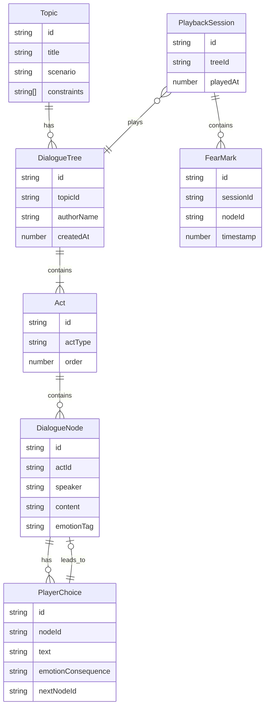

## 1. 架构设计

纯前端应用，所有数据存储在浏览器 localStorage 和 URL 参数中，无后端服务。

```mermaid
flowchart TD
    "前端层 React + TypeScript" --> "状态管理层 Zustand"
    "状态管理层 Zustand" --> "本地存储层 localStorage"
    "状态管理层 Zustand" --> "URL 编码层 base64"
    "URL 编码层 base64" --> "分享链接生成"
    "前端层 React + TypeScript" --> "路由层 React Router"
    "路由层 React Router" --> "题目页 /topic"
    "路由层 React Router" --> "编辑页 /editor/:id"
    "路由层 React Router" --> "回放页 /play/:id"
```

## 2. 技术说明

- **前端框架**：React 18 + TypeScript
- **构建工具**：Vite
- **样式方案**：Tailwind CSS 3
- **状态管理**：Zustand（管理题目、对白树、反馈数据）
- **路由**：React Router DOM v6
- **图标**：lucide-react
- **数据持久化**：localStorage 存储题目与对白数据，分享链接使用 base64 编码压缩后嵌入 URL
- **后端**：无

## 3. 路由定义

| 路由 | 用途 |
|------|------|
| `/` | 首页/题目页，创建或选择题目 |
| `/editor/:id` | 编辑页，根据题目 ID 进入三幕式编辑器 |
| `/play/:id` | 回放页，体验对白并标记害怕位置 |

## 4. 数据模型

### 4.1 数据模型定义



### 4.2 核心数据类型

```typescript
interface Topic {
  id: string;
  title: string;
  scenario: string;
  constraints: string[];
}

type ActType = 'opening' | 'anomaly' | 'collapse';

interface DialogueNode {
  id: string;
  actId: string;
  speaker: 'npc' | 'narrator';
  content: string;
  emotionTag?: string;
  choices: PlayerChoice[];
}

interface PlayerChoice {
  id: string;
  text: string;
  emotionConsequence: string;
  nextNodeId: string | null;
}

interface Act {
  id: string;
  type: ActType;
  order: number;
  nodes: DialogueNode[];
}

interface DialogueTree {
  id: string;
  topicId: string;
  authorName: string;
  acts: Act[];
  createdAt: number;
}

interface FearMark {
  id: string;
  nodeId: string;
  timestamp: number;
}

interface PlaybackFeedback {
  treeId: string;
  marks: FearMark[];
  playedAt: number;
}
```

## 5. 智能提示算法

### 5.1 重复恐吓词检测

- 维护常见恐吓词库（鬼、死、血、影子、哭声、黑暗、腐烂 等 80+ 词）
- 扫描所有 NPC 台词，统计每个恐吓词出现频次
- 同一恐吓词出现 ≥3 次时标红警告："'{词}' 已出现 {n} 次，重复使用会削弱恐惧效果"

### 5.2 NPC 过度解释检测

- 检测 NPC 单条台词长度超过 150 字时警告
- 检测单个阶段内 NPC 累计台词占比超过 75% 时警告
- 检测 NPC 台词中出现"因为""所以""其实是""原因是"等解释性连接词时警告

### 5.3 缺少情绪后果检测

- 遍历所有玩家选项，若选项的 emotionConsequence 为空则标黄警告
- 若某阶段所有选项均无情绪后果，标红警告："此阶段玩家选择毫无情绪代价，恐怖感断裂"
